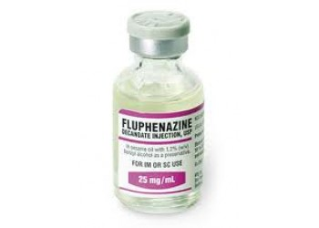

## Sarah Albrecht

## ENGL 105

## Fall 2015

Prolixin was developed in the 1960s by the pharmaceutical company now
known as Novartis as a method of treatment for schizophrenia (NAMI
2007). It is an antipsychotic medication that blocks the positive
symptoms of schizophrenia such as hallucinations and delusions by
restoring the balance of dopamine in the patient’s brain (NAMI 2007).
Prolixin is classified as a "first generation antipsychotic" and is
referred to as a conventional antipsychotic (FDA 2015). Like all first
generation antipsychotics it is required by the FDA to carry a black box
label as of 2008 (FDA 2008).

The side effects listed on this label range from drowsiness and
dizziness to tardive dyskinesia, neuroleptic malignant syndrome (NMS),
and sudden cardiac death (NAMI 2007). Prolixin has a 30-40% chance of
causing tardive dyskinesia (NAMI 2007). Tardive dyskinesia is a disorder
that is characterized by involuntary movements, primarily in the head,
such as tongue rolling, chewing, and grimacing (NLM 2014). While this
disorder can sometimes be reversed if the patient eliminates their usage
of the drug it is not uncommon for the effects to be permanent (NLM
2014). These symptoms additionally have the potential to worsen even
when the drug is no longer being used (NLM 2014). NMS is a
life-threatening neurological condition characterized by sudden high
fever, blood pressure changes, fatigue, and live or kidney abnormalities
(NAMI 2014). If NMS is caught and treated early then the syndrome can be
slowed although there is no guarantee that there will not be a relapse
(NAMI 2014).

  **Side Effects**
  --------------------------------
#> 1.       Dizziness
#> 2.       Drowsiness
#> 3.       Tardive dykinesia
#> 4.       Neuroleptic malignant syndrome

\pagebreak

## Sources

\[FDA\] US Food and Drug Administration. 2008. FDA Requests Boxed
Warnings on Older Class of Antipsychotic Drugs. FDA News Release
(\*\*Edition\*\*) \[Internet\]. \[2013 April 15, cited 2015 August\]
\*\*Journal Info\*\*. Available from:
http://www.fda.gov/NewsEvents/Newsroom[*/*](http://www.fda.gov/NewsEvents/Newsroom/PressAnnouncements/2008/ucm116912.htm)PressAnnouncements/2008/ucm116912.htm

\[NAMI\] National Alliance on Mental Illness Minnesota. Prolixin
(fluphenazine) \[Internet\]. St. Paul (MN): National Alliance on Mental
Illness Minnesota; \[2007 March, cited 2015 August\] . Available from:
http://www.namihelps.org/assets/PDFs/fact-sheets/Medications/Prolilxin.pdf

\[NLM\] U.S. National Library of Medicine. Tardive dyskinesia
\[Internet\]. Bethesda(MD):U.S. National Library of Medicine; \[2014
May, cited 2015 August\] . Available from:
https://www.nlm.nih.gov/medlineplus/ency/article/000685.htm
